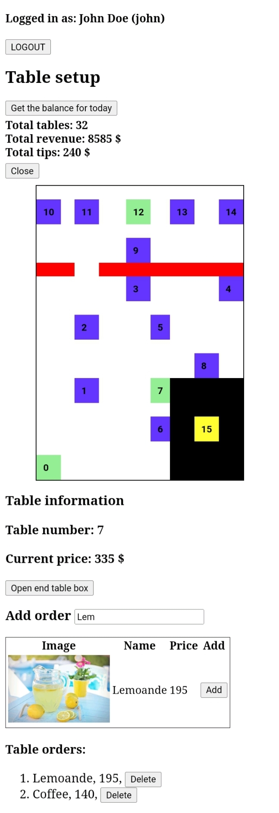
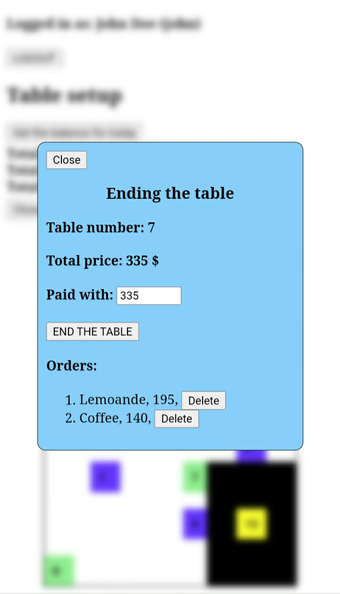
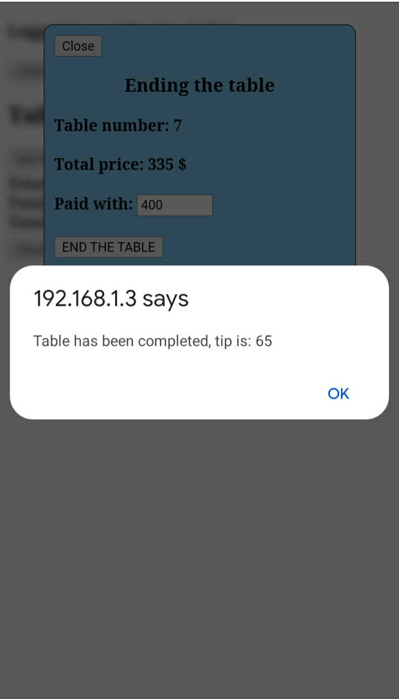

# restaurantTableTracking
Project: Tracking restaurant orders

This project represents a basic CRUD app built using Django and DRF.
The frontend is built using HTML/CSS/JS with jQuery (almost no styling has been done).

The project is based on a specific restaurant with 16 tables with a certain layout, so the frontend and backend are design so that it fits that specific setup (no dynamic layout creation has been implemented).

Flow:

1. User goes to the website
2. In order to to anything he needs to sign in
    - JWT cookie is saved in the browser and it lasts 24 hours
    - Sign in box will only be visible if user is not logged in, the check will happen whenever a user loads a page (everything is on one page, so probably not very often)
3. They can check tables, search products, add/remove orders, check the current day's balance and end the table. The total revenue and tips are calculated and shown on the page


API endpoints:
Default host is localhost:8000 (127.0.0.1:8000), but it can be changed with runserver command for the backend and the edit in the script.js file (first line) for the frontend.

- AUTH
    - POST -> [host]/api/user/login/ -> Sign in to get JWT
    - POST -> [host]/api/user/logout/ -> Removes the JWT
    - GET -> [host]/api/user/user_info/ -> Gets the user information
    - GET -> [host]/api/user/admin_info/ -> Get the data + admin check

- ORDERING
    - POST -> [host]/api/ordering/table/{table_number -> optional} -> Gets all or one table (where completed=False), including the orders
    - POST -> [host]/api/ordering/product/?name=string -> Gets the products based on the name (uses icontains)
    - GET -> [host]/api/ordering/today_info/ -> Info about the day (total tables, revenue and tips)
    - POST/DELETE -> [host]/api/ordering/order/ -> Adds or removes the order, body values are table_number and product_id for adding (POST) and order_id for the DELETE
    - POST -> [host]/api/ordering/end/ -> Ends the table (calculates tip, sets the completed to True and creates a new one). Body params for it are table number and paid_amount


There are of course serializers Table, Order and Product models.

The database is set to sqlite in base_settings.py file, but that could be changed if needed. Create a settings.py file based on base_settings.py

## Running the project

1. Creating a virtual environment

    `python -m venv env`
2. Installing the required packages (inside the restaurantTableTracking directory)

    `pip install -r requirements.txt`
3. Creating a settings.py file from base_settings.py (add the database details)
4. Migrating and creating a super user

    `python manage.py makemigrations`

    `python manage.py migrate`

    `python manage.py createsuperuser`
5. Creating tables, manually through the admin panel or with:

    `python manage.py shell`
    - And running   
    ```
    from tracker.models import Table
    for i in range(16):
        Table.objects.create(table_number=i)
    ```
6. After that you can add the products on the admin page
    1. `python manage.py runserver`
    2. localhost:8000/admin
    3. Products -> Add as many as you like
7. Run the server and enjoy

    `python manage.py runserver` or `python manage.py runserver 0.0.0.0:80`

Although the project wasn't built with mobile in mind, it actually looks decent on smaller screens (nothing fancy, but simple and readable and it gets the job done).

## Examples

<!--  -->
<kbd></kbd>
<kbd></kbd>
<kbd></kbd>
<!--  -->
<!--  -->


### Conclusion
So thats all, a very small project, but the goal of it was to use Django signals, DRF class Views and authentication_classes (built-in and custom ones).


